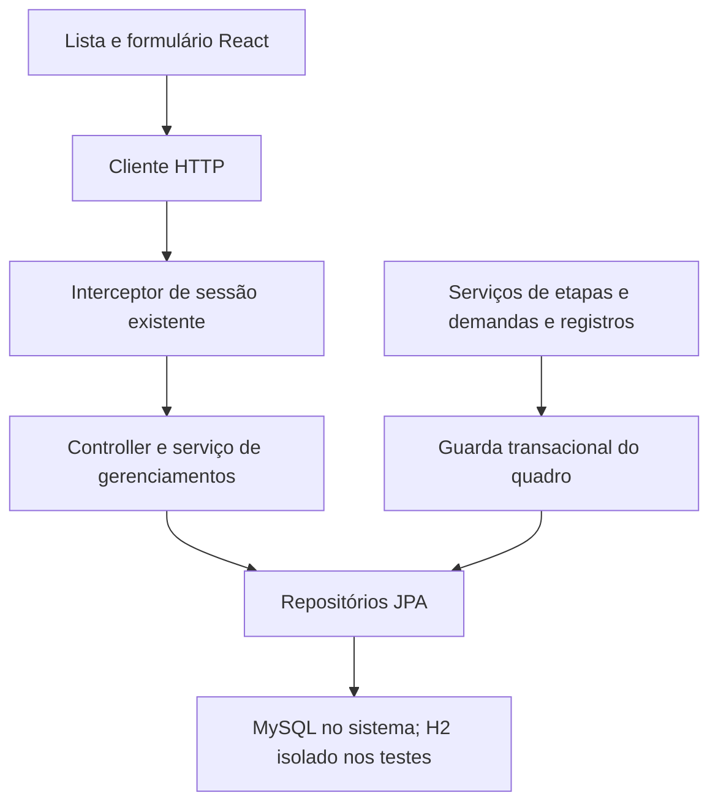

# CRUD de gerenciamentos da Creral: design

**Spec:** `spec.md`
**Status:** execução autorizada pelo usuário em 2026-10-04.

## Architecture Overview

Manter React, Spring MVC, serviços e JPA existentes. O CRUD será implementado nesses componentes, sem introduzir outro sistema de autenticação. O usuário confirmou os comportamentos da especificação e autorizou implementação/testes. As escolhas abaixo são detalhes técnicos necessários para executá-la.

## Code Reuse Analysis

| Componente | Local | Uso |
| --- | --- | --- |
| Sessão existente | `sistema/src/main/java/com/patp/sistema/service/SessaoService.java` | Identificar usuário autenticado, sem confiar em autor enviado pelo cliente. |
| Quadro existente | `sistema/src/main/java/com/patp/sistema/model/Gerenciamento.java` | Preservar IDs/campos/relações e acrescentar estado/versão. |
| Serviços de filhos | `sistema/src/main/java/com/patp/sistema/service/` | Manter comportamento ativo e acrescentar bloqueio por arquivamento. |
| React | `frontend/src/pages/` | Estender lista/formulário/quadro usando os estilos existentes. |
| Maven/JUnit | `sistema/pom.xml` | Testes de API e persistência com Spring Boot e H2 somente de teste. |

## Components and Interfaces

- `GerenciamentoController` usa a sessão, DTOs explícitos e `GerenciamentoService`. Retorna `{id,nome,descricao,criador:{id,nome}|null,arquivado,versao,podeAdministrar}`. Não aceitar relações/autoria/estado do cliente.
- `POST /api/gerenciamentos`: nome, descrição opcional, etapas iniciais opcionais `{nome,setor,ordem}`; 201. O serviço salva pai e etapas em uma única transação.
- `GET /api/gerenciamentos?arquivado=false|true`: filtro booleano estrito, padrão false; 200. `GET /api/gerenciamentos/{id}`: 200/404.
- `PUT /api/gerenciamentos/{id}`: `{nome,descricao,versao}`; 200. `PUT /api/gerenciamentos/{id}/arquivar` e `/restaurar`: `{versao}`; 204.
- `GerenciamentoGuard` concentra busca sob lock e exigência de ativo. Serviços de filhos obtêm primeiro o ID persistido do quadro por consulta escalar, depois bloqueiam o quadro e só então carregam filhos, evitando estado antigo no contexto JPA.
- `ApiException`/advice traduzem erro de domínio para `{erro}`, status previsto e erro de persistência genérico. Converter também falhas estruturais de JSON e tipos inválidos para 400. Não divulgar detalhes do banco.
- `Usuario` tem papel persistido `FUNCIONARIO`/`ADMINISTRADOR`; legado nulo equivale a funcionário. Cadastro rejeita ID e força funcionário. Senha aceita na entrada e nunca serializada na saída. Seleção de administrador será uma atualização confiável de conta existente, documentada e não executada no banco real.
- `frontend/src/services/api.js` aceita 204, mantém erros de API e distingue comunicação sem confirmação. Operações do CRUD usam token, filtro e versão; criação não tem repetição automática.
- `CriarGerenciamento` serve criação e edição com campos rotulados, etapas iniciais opcionais apenas ao criar, cancelamento sem mutação, valores preservados após erro e guarda contra envio duplicado.
- `Gerenciamentos` mantém filtro, seleção, confirmação acessível, permissões fornecidas pelo servidor e estado de consulta separado da mutação. Mutação confirmada seguida de falha no GET apresenta o aviso específico e permite repetir somente GET.
- `Quadro` mostra estado arquivado e consulta etapas sem controles de alteração. O botão atual de criar processo será tratado no requisito próprio.

## Data Models

Gerenciamento conserva nome/descrição com colunas de 255, criador nullable. Acrescentar `arquivado` com padrão false e `versao` com `@Version` e padrão 0. Consultas tratam marcador antigo/null como ativo; migração não trunca nomes antigos nem inventa criadores. Versão deve ser inteira não negativa na entrada, sem conversão silenciosa de decimais/strings.

Usuario conserva ID/nome/setor/email/senha e acrescenta papel com padrão funcionário. Não usar lista de IDs futuros nem concessão automática a e-mails de cadastro.

## Transactions and Concurrency

Todas as escritas de conteúdo e arquivar/restaurar adquirem `PESSIMISTIC_WRITE` no mesmo registro de gerenciamento em transação. A validação do estado acontece depois do lock. A edição usa também a versão lida pelo cliente: divergência retorna 409. Repetição de estado já aplicado, com versão em formato válido e usuário autorizado, é 204 sem alteração de versão. Não retornar sucesso antes de commit. Duas ordens de disputa serão testadas com threads coordenadas e contagens/valores persistidos.

## Error Handling Strategy

Status/textos seguem `spec.md`: autenticação, existência, autorização, estado, versão e campos para JSON estruturalmente válido. Requisição sem versão, versão inválida ou JSON inválido retorna 400. Banco falhou: 500 genérico e rollback. Na interface, erro de rede não afirma ausência de gravação; erro de atualização posterior não reenvia mutação.

## Risks & Concerns

| Preocupação | Local | Impacto | Mitigação |
| --- | --- | --- | --- |
| Senha serializada | `sistema/src/main/java/com/patp/sistema/model/Usuario.java:64` | Hash vazado inclusive por relações | Propriedade de escrita apenas e DTO de quadro; testes de resposta. |
| Pai e etapas sem transação | `sistema/src/main/java/com/patp/sistema/service/GerenciamentoService.java:30` | Quadro parcial após falha | Transação com teste de falha na segunda inserção. |
| Entidade recebida no POST de processo | `sistema/src/main/java/com/patp/sistema/service/ProcessoService.java` | Atualização via criação e vínculo falsificado | Rejeitar ID e resolver vínculo persistido antes do guarda. |
| Relações eager e cache JPA | `sistema/src/main/java/com/patp/sistema/model/Processo.java` | Estado arquivado antigo durante disputa | Consulta escalar do pai antes de carregar entidades e lock no pai. |
| Teste padrão usa banco configurado | `sistema/src/test/java/com/patp/sistema/SistemaApplicationTests.java:6` | Risco aos dados existentes | Recursos de teste substituem datasource por H2; assert explícito da URL. |
| Ausência de testes frontend | `frontend/package.json` | Regressões em erros/foco/envio | Vitest, Testing Library e fluxo em navegador, com dados fictícios. |
| Artefatos gerados rastreados | `frontend/node_modules/`, `sistema/target/` | Commits ruidosos | Staging explícito só de fontes/testes/documentos; não remover arquivos do usuário. |
| H2 não reproduz integralmente MySQL | `sistema/pom.xml` | Migração/collation podem diferir | Registrar limite e conferir MySQL isolado se disponível, nunca usar instância configurada por suposição. |

## Tech Decisions

| Escolha | Motivo |
| --- | --- |
| Papel persistido no usuário | Concede administração a uma conta existente; cadastro público não altera papel. |
| DTO no CRUD | Expõe permissão calculada e evita entidades sensíveis em respostas de quadro. |
| Lock no quadro e versão do cliente | Ordena alterações de filhos e protege edição antiga com resultado observável. |
| Integração HTTP + banco nos testes | Exercita sessão real do projeto, autorização, transações e status conjuntamente. |
| H2 test scope | Executa testes sem tocar o MySQL existente; dependência não entra no runtime normal. |
| Testes React de comportamento | Verificam valores, chamadas HTTP, foco e controles por contrato, sem copiar implementação. |

Documentação primária consultada após leitura do código: [Spring Data JPA locking](https://docs.spring.io/spring-data/jpa/reference/jpa/locking.html), [Spring Boot testing](https://docs.spring.io/spring-boot/reference/testing/spring-boot-applications.html), [Vitest guide](https://vitest.dev/guide/). Context7 não está disponível nesta sessão.
